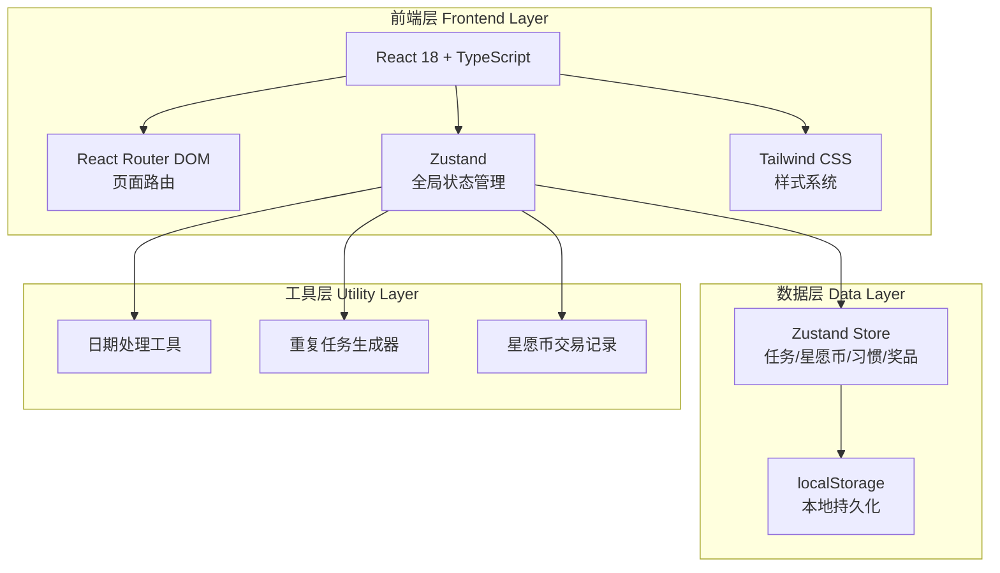
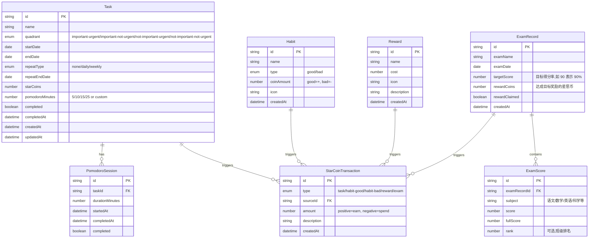

## 1. 架构设计

本项目为纯前端应用,使用浏览器 localStorage 进行数据持久化,无需后端服务。



## 2. 技术说明

- **前端框架**: React 18 + TypeScript
- **构建工具**: Vite
- **样式方案**: Tailwind CSS 3
- **状态管理**: Zustand(轻量级,适合本项目规模)
- **路由**: React Router DOM 6
- **图标库**: lucide-react
- **数据持久化**: localStorage(无后端,离线可用)
- **初始化工具**: vite-init (react-ts 模板)

## 3. 路由定义

| 路由 | 页面 | 用途 |
|------|------|------|
| `/` | 任务清单页 | 四象限任务管理、任务列表、新建/编辑任务 |
| `/pomodoro` | 番茄钟页 | 番茄计时、任务关联、专注完成奖励 |
| `/rewards` | 星愿币页 | 星愿币统计、习惯管理、奖品兑换 |
| `/scores` | 成绩单页 | 各科考试成绩录入、成绩记录列表、科目筛选 |
| `/analysis` | 成绩分析页 | 成绩趋势图、科目对比雷达图、进步分析、统计摘要 |

## 4. 数据模型

### 4.1 数据模型定义



### 4.2 数据存储结构

localStorage 采用单一 key `forest-guard-data` 存储 JSON:

```typescript
interface AppData {
  tasks: Task[];
  habits: Habit[];
  rewards: Reward[];
  transactions: StarCoinTransaction[];
  pomodoroSessions: PomodoroSession[];
  examRecords: ExamRecord[];
  balance: number; // 当前星愿币余额(冗余字段,加速读取)
}
```

### 4.3 状态管理 Store 设计

```typescript
// 使用 Zustand 创建全局 store
interface AppStore {
  // 数据
  tasks: Task[];
  habits: Habit[];
  rewards: Reward[];
  transactions: StarCoinTransaction[];
  examRecords: ExamRecord[];
  balance: number;

  // 任务相关
  addTask: (task: Omit<Task, 'id' | 'createdAt'>) => void;
  updateTask: (id: string, updates: Partial<Task>) => void;
  deleteTask: (id: string) => void;
  completeTask: (id: string) => void;

  // 习惯相关
  addHabit: (habit: Omit<Habit, 'id' | 'createdAt'>) => void;
  triggerHabit: (id: string) => void;

  // 奖品相关
  addReward: (reward: Omit<Reward, 'id' | 'createdAt'>) => void;
  redeemReward: (id: string) => boolean;

  // 番茄钟相关
  startPomodoro: (taskId: string, minutes: number) => void;
  completePomodoro: (sessionId: string) => void;

  // 成绩相关
  addExamRecord: (record: Omit<ExamRecord, 'id' | 'createdAt'>) => string;
  deleteExamRecord: (id: string) => void;
  claimExamReward: (id: string) => void;

  // 持久化
  persist: () => void;
}
```

## 5. 重复任务生成逻辑

当用户查看某日任务时,系统根据任务模板生成当日任务实例:

- **每日重复**: 从 startDate 到 repeatEndDate(或今天,取较小者),每天都生成实例
- **每周重复**: 从 startDate 开始,每隔 7 天生成实例
- **无重复**: 仅在 startDate 当天显示

任务实例不单独存储,而是通过任务模板 + 日期计算动态生成,避免数据膨胀。任务完成状态按日期记录在 `completedDates: string[]` 中(ISO 日期字符串)。

## 6. 项目目录结构

```
src/
├── components/          # 通用组件
│   ├── GlassCard.tsx           # 毛玻璃卡片容器
│   ├── ForestBackground.tsx    # 森林背景动画
│   ├── Navigation.tsx          # 侧边导航栏
│   ├── StarCoinBadge.tsx       # 星愿币徽章
│   ├── TaskCard.tsx            # 任务卡片
│   ├── QuadrantGrid.tsx        # 四象限网格
│   ├── TaskFormModal.tsx       # 任务表单弹窗
│   ├── ExamFormModal.tsx       # 成绩录入弹窗
│   ├── ExamCard.tsx            # 考试成绩卡片
│   ├── TrendChart.tsx          # 成绩趋势折线图
│   ├── RadarChart.tsx          # 科目雷达图
│   └── StatCard.tsx            # 统计摘要卡片
├── pages/               # 页面组件
│   ├── TaskListPage.tsx        # 任务清单页
│   ├── PomodoroPage.tsx        # 番茄钟页
│   ├── RewardsPage.tsx         # 星愿币页
│   ├── ScoresPage.tsx          # 成绩单页
│   └── AnalysisPage.tsx        # 成绩分析页
├── store/               # 状态管理
│   └── useAppStore.ts          # Zustand 全局 store
├── types/               # 类型定义
│   └── index.ts
├── utils/               # 工具函数
│   ├── date.ts                 # 日期处理
│   ├── repeatTask.ts           # 重复任务生成
│   ├── scoreStats.ts           # 成绩统计计算
│   └── storage.ts              # localStorage 读写
├── App.tsx
├── main.tsx
└── index.css                  # Tailwind + 全局样式
```
